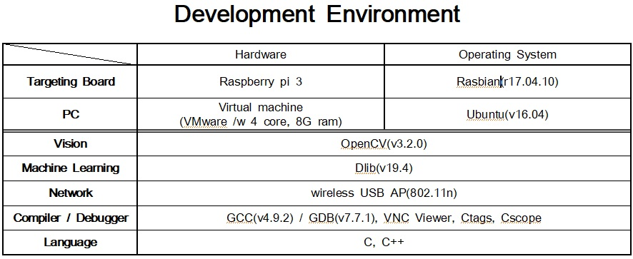
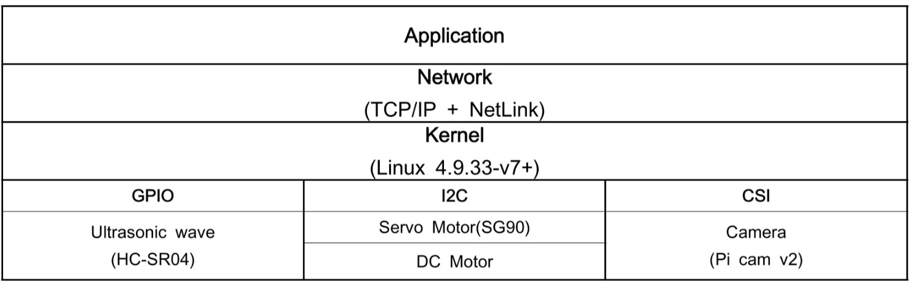
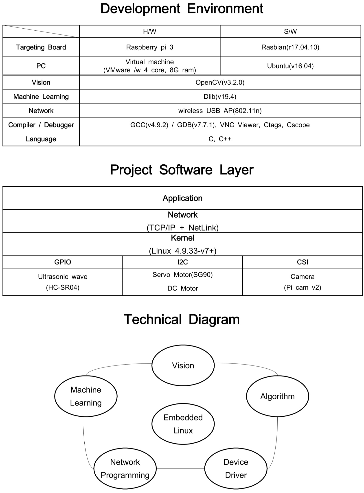
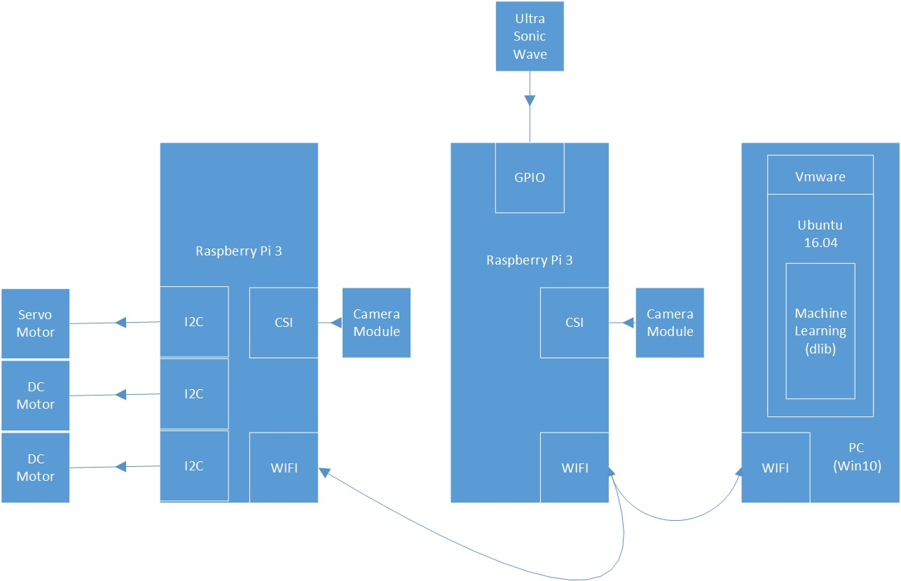
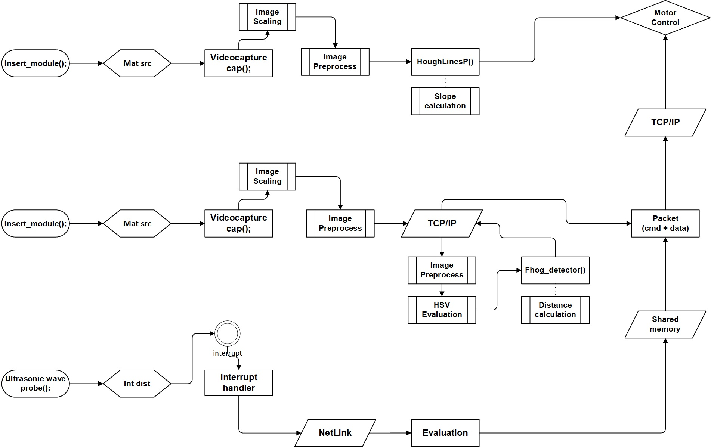
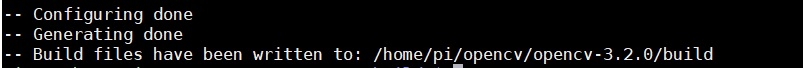
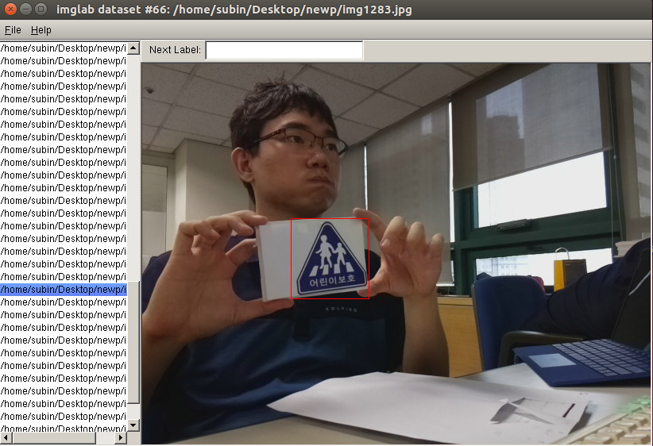

Bit Autonomous RC Car Project 
======================

Note: this repository was created for the final project of bit IoT embedded system developer course and won't receive any major updates. Still, you can use this repository as a study reference or for some practical purposes.

| junghwk | yeogue | jaebum44 | desung7 |
| :---: | :---: | :---: | :---: |
| OpenCV | OpenCV | OpenCV | OpenCV |
| dlib | device driver | device driver | dlib |
| network | git management | hardware | network |
| schedule management |  |  | hardware |

## Table of content

- [Introduction](#introduction)
    - [Development Environment](#development-environment)
    - [Project Software Layer](#project-software-layer)
    - [Technical Diagram](#technical-diagram)
    - [Block Diagram](#block-diagram)
    - [Flow Chart](#flow-chart)
    
- [OpenCV](#opencv)

- [Machine Learning](#machine-learning)

- [Network](#network)

- [Device Driver](#device-driver)
 

## Introduction

### Development Environment



### Project Software Layer



### Technical Diagram



### Block Diagram



### Flow Chart



## OpenCV

### Install

1. Install Packages 

```
sudo apt-get install build-essential cmake |\ 
sudo apt-get install pkg-config |\
sudo apt-get install libjpeg-dev libtiff5-dev libjasper-dev libpng12-dev |\
sudo apt-get install libavcodec-dev libavformat-dev libswscale-dev |\
sudo apt-get install libxvidcore-dev libx264-dev libxine2-dev |\
sudo apt-get install libv4l-dev v4l-utils |\
sudo apt-get install libgstreamer1.0-dev libgstreamer-plugins-base1.0-dev |\
sudo apt-get install libqt4-dev |\
sudo apt-get install mesa-utils libgl1-mesa-dri libqt4-opengl-dev |\
sudo apt-get install libatlas-base-dev gfortran libeigen3-dev |\
```

2. Download OpenCV

```
mkdir opencv |\
cd opencv |\
git clone https://github.com/Itseez/opencv/archive/3.2.0.zip |\
unzip opencv.zip |\
git clone https://github.com/Itseez/opencv_contrib/archive/3.2.0.zip |\
unzip opencv_contrib.zip |\
```

### Build 

1. Build settings

```
cd opencv-3.2.0 |\
mkdir build |\
cd build |\
cmake -D CMAKE_BUILD_TYPE=RELEASE \
-D CMAKE_INSTALL_PREFIX=/usr/local \
-D WITH_TBB=OFF \
-D WITH_IPP=ON \
-D WITH_1394=OFF \
-D BUILD_WITH_DEBUG_INFO=OFF \
-D BUILD_DOCS=OFF \
-D INSTALL_C_EXAMPLES=ON \
-D INSTALL_PYTHON_EXAMPLES=ON \
-D BUILD_EXAMPLES=OFF \
-D BUILD_TESTS=OFF \
-D BUILD_PERF_TESTS=OFF \
-D ENABLE_NEON=ON \
-D WITH_QT=ON \
-D WITH_OPENGL=ON \
-D OPENCV_EXTRA_MODULES_PATH=../../opencv_contrib-3.2.0/modules \
-D WITH_V4L=ON  \
-D WITH_FFMPEG=ON \
-D WITH_XINE=ON \
-D BUILD_NEW_PYTHON_SUPPORT=ON \
-D INSTALL_C_EXAMPLES=ON \
-D INSTALL_PYTHON_EXAMPLES=ON \
-D BUILD_EXAMPLES=ON \
../
```

If there's no issues, you will see these messages below.  



2. Compling

Use parallel compling by -j option of make. Check out your cpu information with the statement like below. 

```
cat /proc/cpuinfo | grep processor | wc -l
```
Then determine the number of cores that you want to allocate for compiling
```
time make -j4
sudo make install
```

### Options

Check your directory using the statement below and confirm whether /usr/local/lib exists or not. 

```
cat /etc/ld.so.conf.d/*
```
If there's no file /usr/local/bin in your directory /etc/ld.so.conf.d/*  

```
sudo sh -c 'echo '/usr/local/lib' > /etc/ld.so.conf.d/opencv.conf'|\
sudo ldconfig
```
You can check the version of OpenCV you've installed using the statement like below.

```
pkg-config --modversion openc
```

## Machine Learning

We've trained our own traffic sign + traffic light detectors using dlib and its implementation of the Felzenszwalb's version of the Histogram of Oriented Gradients (HoG) detector. The training examples used in this repository are from Korean road signs, but the classifier should work with any traffic signs, as long as you train it properly. We used Naver Map images, several captures from webcam and etc. Just note that there are methods with better results than HoG for traffic sign detector, such as Deep Learning architectures. 

### Install

```
git clone https://github.com/davisking/dlib.git
```

### Build

```
sudo su
cd dlib/example
mkdir build
cd build 
cmake .. -DUSE_AVX_INSTRUCTIONS=1
cmake --build . --config Release
```

if an example requires GUI, check this macro below to DLIB_NO_GUI_SUPPORT=OFF and confirm in CMakeLists.txt
```
macro(add_gui_example name)
   if (DLIB_NO_GUI_SUPPORT=OFF)
      message("No GUI support, so we won't build the ${name} example.")
   else()
      add_example(${name})
   endif()
endmacro()
```

### Mark signs on images

1. Compile `imglab`:

```
cd dlib/tools/imglab
mkdir build
cd build
cmake ..
cmake --build .
```

2. Create XML from sample images:

```
dlib/tools/imglab/build/imglab -c training.xml /path/to/dir/train
dlib/tools/imglab/build/imglab training.xml
dlib/tools/imglab/build/imglab -c testing.xml /path/to/dir/test
dlib/tools/imglab/build/imglab testing.xml
```

3. Use `shift+click` to draw a box around signs.



**Note:** If you want to use different aspect ratios, then make all your truth boxes have the same or nearly the same aspect ratio. You can access those parameters in your training code like this below. 

``` 
scanner.set_detection_window_size(80, 80);  
``` 

**Note:** Your training code will throw an exception if it detects any boxes that are impossible to detect given your setting of scanning window size and image pyramid resolution. If you want to discard these impossible boxes automatically from your training data, then use a statement like below before running the trainer.

```
remove_unobtainable_rectangles(trainer, images_train, face_boxes_train);   
```

**Note:**  To add more image metadata to your XML datasets, use this statement like this below. It will add the image metadata from <arg1> into <arg2>. If any of the image tags are in both files then the ones in <arg2> are deleted and replaced with the image tags from <arg1>. The results are saved into merged.xml and neither <arg1> or <arg2> files are modified. Use -h option for more details.  

```
./imglab --add <arg1> <arg2>
```
        
        
### Train the fHOG_object_detector

To train a fHOG_object_detector, run `fhog_object_detector_ex`. For example, to run the detector on the `/dir/image` folder with your XML datasets.  

```
dlib/example/build/fhog_object_detector_ex /path/to/dir/image
```

The detector will show test images with marks on and your results will be saved into the file `*svm`.


### How to use your own models in your project 

1. How to compile:

```
cd dlib/example/
cp fhog_object_detector_ex.cpp my_fhog_object_detector.cpp
g++ -std=c++11 -O3 -I.. ../dlib/all/source.cpp -lpthread -lX11 -DDLIB_JPEG_SUPPORT -ljpeg my_fhog_object_detector.cpp -o my_fhog_ex `pkg-config --cflags --libs opencv` -DUSE_SSE2_INSTRUCTIONS=ON -DUSE_AVX_INSTRUCTIONS=ON -DUSE_SSE4_INSTRUCTIONS=ON
```

2. How to recall detector.svm in your training code:

```
dlib::object_detector<image_scanner_type> detector;
dlib::deserialize("my.svm") >> detector;
```

**Note:**  This format is crucial. `*_ex` 

**Note:**  To compile using `cmake` in dir/build, make your own customized CMakeLists.txt 

## Network

## Device Driver

